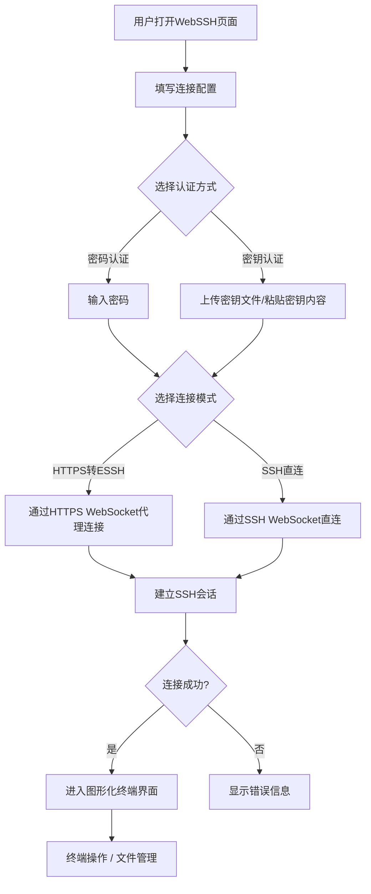

## 1. 产品概述

WebSSH 是一个基于浏览器的 SSH 远程连接工具，提供图形化界面让用户通过网页直接连接远程服务器。支持密码认证和密钥认证两种方式，提供 HTTPS 转 ESSH 和 SSH 直连两种连接模式，连接后提供完整的终端和文件管理图形化界面。

- **核心目标**：让用户无需安装本地 SSH 客户端，通过浏览器即可安全连接远程服务器
- **目标用户**：运维工程师、开发人员、系统管理员等需要远程管理服务器的用户

## 2. 核心功能

### 2.1 用户角色

| 角色 | 注册方式 | 核心权限 |
|------|----------|----------|
| 普通用户 | 无需注册 | 创建和管理 SSH 连接、使用终端和文件管理器 |

### 2.2 功能模块

1. **连接页面**：连接配置、认证方式选择、连接历史
2. **终端页面**：交互式 SSH 终端、多标签会话管理
3. **文件管理页面**：远程文件浏览、上传下载、文件编辑

### 2.3 页面详情

| 页面名称 | 模块名称 | 功能描述 |
|----------|----------|----------|
| 连接页面 | 连接配置表单 | 输入主机、端口、用户名，选择连接方式（HTTPS转ESSH / SSH直连） |
| 连接页面 | 认证方式切换 | 支持密码认证和密钥文件上传认证，密钥支持拖拽上传和文本粘贴 |
| 连接页面 | 连接历史 | 保存最近连接记录，快速重连 |
| 终端页面 | 终端模拟器 | 基于 xterm.js 的全功能终端，支持颜色、光标、复制粘贴 |
| 终端页面 | 多标签管理 | 支持同时打开多个 SSH 会话，标签页切换 |
| 终端页面 | 终端工具栏 | 终端设置（字体大小、主题）、复制粘贴、全屏切换 |
| 文件管理页面 | 文件浏览器 | 远程服务器文件目录树浏览，文件列表展示 |
| 文件管理页面 | 文件操作 | 上传、下载、新建、删除、重命名文件/文件夹 |
| 文件管理页面 | 文件编辑器 | 在线编辑文本文件，语法高亮 |

## 3. 核心流程

用户打开网页 → 填写连接信息（主机/端口/用户名）→ 选择认证方式（密码/密钥）→ 选择连接模式（HTTPS转ESSH / SSH直连）→ 点击连接 → 后端建立SSH通道 → 前端通过WebSocket接收终端数据 → 用户在图形化终端中操作 → 可切换到文件管理器进行文件操作

## 4. 用户界面设计

### 4.1 设计风格

- **主色调**：深色科技风 — 深灰/近黑背景 (#0a0e17)，荧光绿 (#00ff88) 作为主强调色，辅以冷蓝色 (#0ea5e9)
- **按钮风格**：圆角矩形，带微光边框效果，hover 时发光增强
- **字体**：终端使用 JetBrains Mono，界面使用 Space Grotesk
- **布局风格**：左侧导航栏 + 主内容区，终端全屏自适应
- **图标风格**：线性图标（Lucide），荧光绿色强调

### 4.2 页面设计概述

| 页面名称 | 模块名称 | UI元素 |
|----------|----------|--------|
| 连接页面 | 连接配置表单 | 深色卡片式表单，输入框带发光边框，连接模式切换为标签式选择器，认证方式为单选切换 |
| 连接页面 | 密钥上传区域 | 拖拽上传区域，虚线边框，支持点击选择文件，密钥内容文本域 |
| 连接页面 | 连接历史 | 侧边卡片列表，显示主机名/用户名/时间，hover 高亮 |
| 终端页面 | 终端区域 | 全宽 xterm.js 终端，深色背景，荧光绿光标，自适应窗口大小 |
| 终端页面 | 标签栏 | 顶部标签栏，标签带关闭按钮，新增标签按钮 |
| 终端页面 | 工具栏 | 底部/顶部工具条，图标按钮，字体大小滑块，主题选择 |
| 文件管理页面 | 文件浏览器 | 左侧目录树 + 右侧文件列表，双栏布局 |
| 文件管理页面 | 文件操作栏 | 顶部操作按钮组（上传/下载/新建/删除），面包屑导航 |

### 4.3 响应式设计

- 桌面优先设计，终端和文件管理器在宽屏下体验最佳
- 平板端：文件管理器切换为单栏模式
- 移动端：终端自适应宽度，文件管理器仅显示文件列表

### 4.4 3D场景指导

不适用
