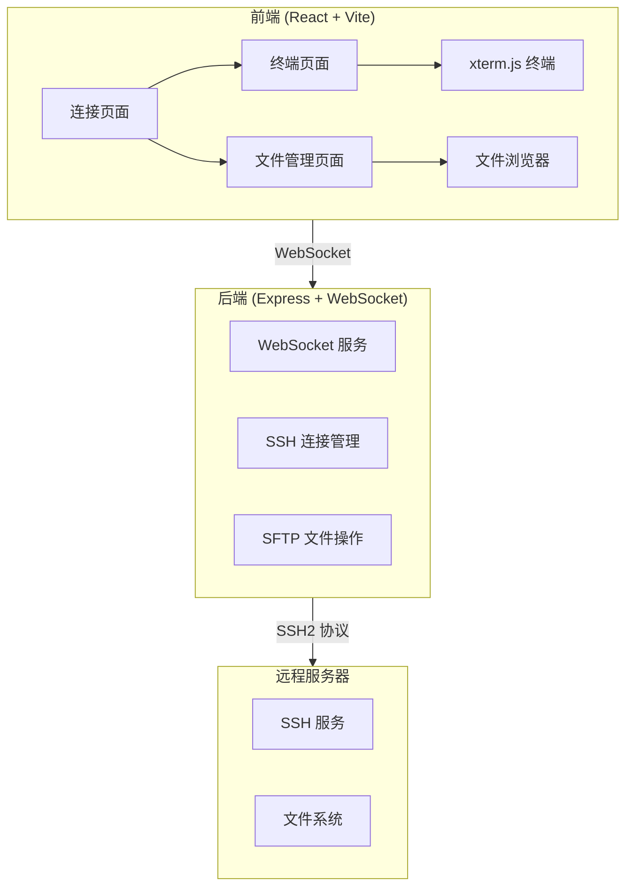
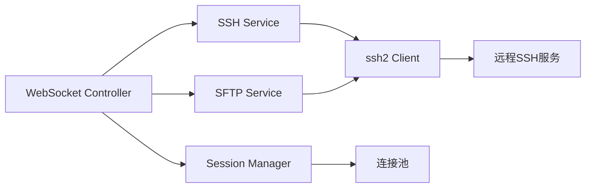

## 1. 架构设计



## 2. 技术说明

- **前端**：React@18 + TypeScript + Tailwind CSS@3 + Vite
- **初始化工具**：vite-init (react-express-ts 模板)
- **后端**：Express@4 + ws (WebSocket) + ssh2
- **终端**：xterm.js + xterm-addon-fit + xterm-addon-web-links
- **状态管理**：Zustand
- **数据库**：无（连接历史使用 localStorage）

## 3. 路由定义

| 路由 | 用途 |
|------|------|
| `/` | 连接页面 — SSH连接配置和历史记录 |
| `/terminal/:sessionId` | 终端页面 — SSH交互式终端 |
| `/files/:sessionId` | 文件管理页面 — 远程文件浏览和操作 |

## 4. API 定义

### 4.1 WebSocket 消息协议

**客户端 → 服务端**

```typescript
// 创建SSH连接
interface ConnectMessage {
  type: 'ssh-connect';
  sessionId: string;
  host: string;
  port: number;
  username: string;
  authType: 'password' | 'key';
  password?: string;
  privateKey?: string;
  passphrase?: string;
  mode: 'essh' | 'direct'; // HTTPS转ESSH / SSH直连
}

// 终端输入
interface TerminalInputMessage {
  type: 'terminal-input';
  sessionId: string;
  data: string;
}

// 终端大小变更
interface TerminalResizeMessage {
  type: 'terminal-resize';
  sessionId: string;
  cols: number;
  rows: number;
}

// 文件操作请求
interface FileOperationMessage {
  type: 'file-operation';
  sessionId: string;
  operation: 'list' | 'download' | 'upload' | 'mkdir' | 'delete' | 'rename' | 'read' | 'write';
  path: string;
  data?: string | ArrayBuffer;
  newName?: string;
}

// 断开连接
interface DisconnectMessage {
  type: 'ssh-disconnect';
  sessionId: string;
}
```

**服务端 → 客户端**

```typescript
// 连接结果
interface ConnectResultMessage {
  type: 'ssh-connected' | 'ssh-error';
  sessionId: string;
  error?: string;
}

// 终端输出
interface TerminalOutputMessage {
  type: 'terminal-output';
  sessionId: string;
  data: string;
}

// 文件操作结果
interface FileResultMessage {
  type: 'file-result';
  sessionId: string;
  operation: string;
  success: boolean;
  data?: any;
  error?: string;
}
```

## 5. 服务端架构图



## 6. 数据模型

不适用 — 本项目不使用数据库，连接历史存储在浏览器 localStorage 中。

### 6.1 localStorage 数据结构

```typescript
interface ConnectionHistory {
  id: string;
  host: string;
  port: number;
  username: string;
  authType: 'password' | 'key';
  mode: 'essh' | 'direct';
  label?: string;
  lastConnected: number; // timestamp
}
```
